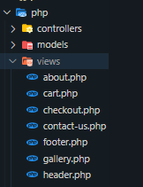
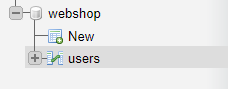
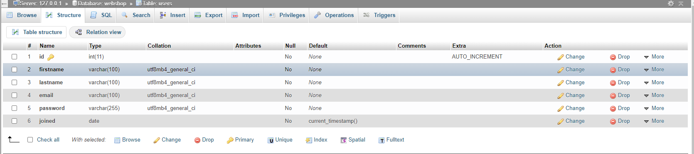
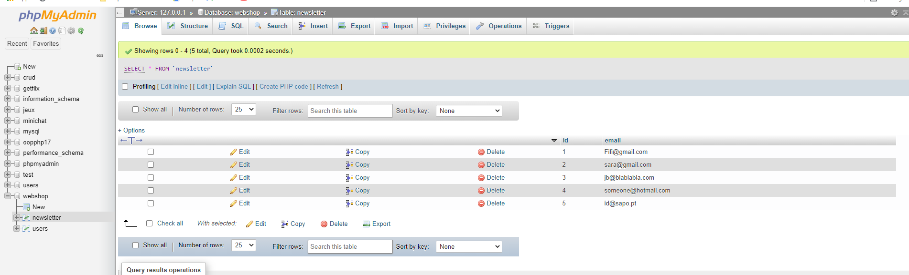
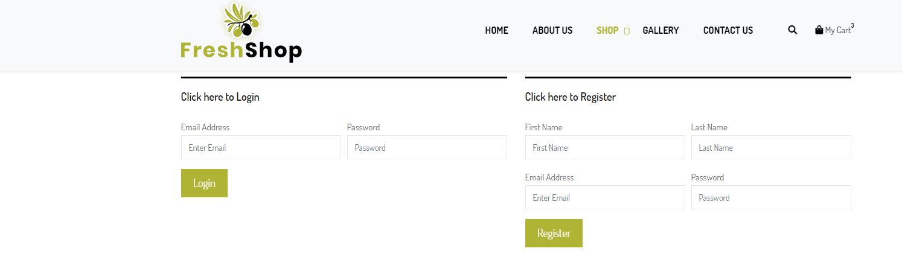

# e-shopOOP
### What, Why  
This project is about building the backend for a webshop, as a consolidation exercise of Object Oriented PHP. 
All the frontend was provided by BeCode.

I have started by analyzing all of the template files and I've  realized that there was a lot of repetition in the code. So the first thing I did was to eliminate at least some of the repetition. I put the header, the instagram feed, and the footer into separate files, although I'm not sure I've done it correctly, since I've included the head of the page in the header, and the JS links in the footer. I will probably change that in the meantime. Anyway, at least I have less lines of code now. I also started reorganizing the folders, because we need to use the MVC structure (Model View Controller). So I've changed all the html extensions into php, and I've put all inside the views folder. 

### When
We should have about a week to complete the project, depending on the general progress of the class.

### How (technical challenges) 
Basically everything seems like a technical challenge at this point, although the Newsletter seems like a simple thing to do, since we only need to add the email to the database. Therefore, my next step will be to create the database and start by feature number 5 (check things to do), the Newsletter.

#### Newsletter

* step 1: create the database

    I've created a database named webshop and a table named users

 

 

Meanwhile, I've decided to create another table for the newsletter, only with a column id and a column email. 

 

* step 2: connection to the database

* step 3: inserting the data (email) into the database

    I have finally managed to insert the email into the database, so it's time to move to the next step: the register/login system.

#### Register/Login System

* step 1: create a page for the register form and a page for the login form.
    
    The site already includes the forms, in the area of checkout, so I will just copy the code and paste it into the correspondent file (in the folder views).

### Who
My name is Sara and I'm learning Web Development at BeCode.

### Things to do
1. Register/login system ---------------------------------- in progress
2. Search bars (one for the header and one for the shop)
3. Sort items (shop) 
4. Make the shopping cart work 
5. Newsletter (add email to the database) :heavy_check_mark:
6. Client account